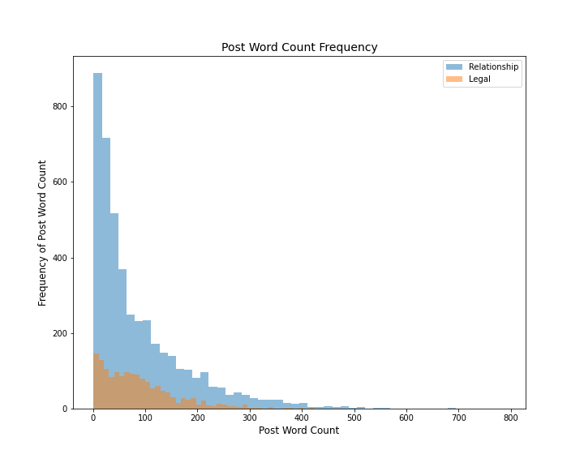
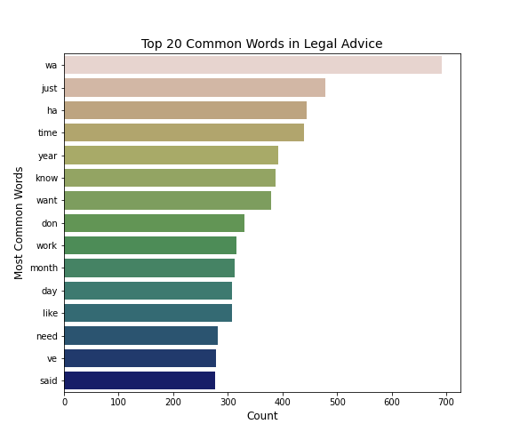
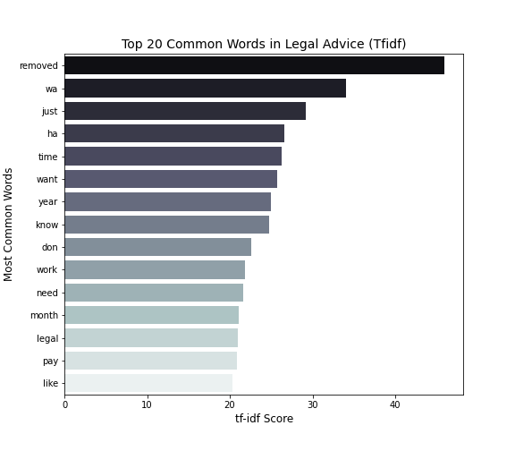
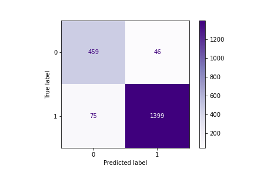
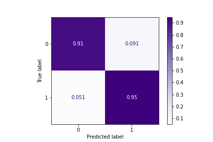

# Subreddit Reclassification
</img>

## Contents

* [Executive Summary](#Executive-Summary)
* [Problem Statement](#Problem-Statement)
* [Process](#Process)
* [Conclusion and Suggestions](#Conclusion-and-Suggestions)
* [Data Dictionary](#Data-Dictionary)

## Executive Summary

This report provides the full scope of natural language processing and classification model evaluation of subreddits. Methods include webscraping, API, various types of classification models - naive bayes, logistic regression, decision trees, etc - vectorization, and lemmatization. Results of prediction models  show that we could perform reclassification with high sensitivity (95%) and specificity (91%). However, this multinomial naive bayes model was only tested against 2 subreddits, and we suggest that we should try this model with other subreddits as well to improve its accuracy.

## Problem Statement

Ever since pandemic happened, all of Reddit's employees are working from home. Majority of the employees do have dogs and cats, and subreddit categorization has been removed due to one of the cats jumping on the keyboard as the cat being mischievous. We were tasked to find the model to put the posts back to their original subreddits using only their texts.

## Process

* <b>Data Collection</b>  
We scraped the posts from the web, using Pushshift API. We were able to get about 6000 posts, including author information, created time, and other post related details.

* <b>Data Cleaning</b> 
We identified some of the features in the dataset that we are not interested in. We dropped the unnecessary columns, and combined all the texts to maximize the contents quality. Also we deleted a few rows that did not contain any text since they can be deemed as null values. 

* <b>Feature Engineering</b> 
We created a few columns - including word counts, which contains number of words in a post, all the text fields combined as 'text_all' and lemmatized texts with regular expression as 'texts_cleaned' for our analysis and modeling. 

* <b>Exploratory Data Analysis and Visualization</b> 
For exploratory data analysis, we looked at how words counts are distributed, as well as most common words for each subreddits we gathered the data from using both CountVectorizer and TfidfVectorizer. 

   
  
  

* <b>Modeling</b> 
The models we tried all did better than baseline, which was ~0.75 for relationship advice and ~0.25 for legal advice. The models are - Multinomial Naive Bayes, Logistic Regression, Random Forest, Extra Trees, Voting Classifier with AdaBoost, GradientBoost, and Decision Trees, and Support Vector Machines. All of these were CountVectorized and TfidfVectorized first. Each model had pretty good prediction and some did better than the other.

* <b>Best Model</b> 
The model that performed best was Multinomial Naive Bayes model with CountVectorizer. Its parameters were: 6000 max features, 0.85 max document frequency, with at least 1 occurance as minimum document frequency count. Also, it did perform without any stop words and only examined the individual words. Its best score was ~0.938 and its score did not fluctuate much from train to test dataset. Sensitivity  was 95% and specificity was 91%. 

  
  

## Conclusion and Suggestions

Even though it performed really well, we recommend to try this model with other subreddits to improve the model better and for better accuracy score. The model as it is scoring 97% precision and 94% accuracy, which gives us a room to tweak.

## Data Dictionary

| Dataset     | Variables       | Data Type | Description                                   | Data options                     |
| ----------- | --------------- | --------- | --------------------------------------------- | -------------------------------- |
| reddit_final| subreddit       | str       | Which Subreddit the post is from              | legaladvice, relationship_advice |                             
|             | text_all        | str       | Post content                                  |                                  |
|             | y               | int       | Target Variable                               | 0, 1                             |
|             | texts_cleaned   | str       | Post after regular expression and lemmatizing |                                  |
|             | posts_w_cnt     | int       | Number of words used in a post                |                                  |

## Directory

|__ Code 
|&nbsp;&nbsp;&nbsp;&nbsp;&nbsp;|__ [01-Creating DB.ipynb](./code/01-CreatingDB.ipynb)  
|&nbsp;&nbsp;&nbsp;&nbsp;&nbsp;|__ [02-Cleaning DB.ipynb](./02-CleaningDB.ipynb)  
|&nbsp;&nbsp;&nbsp;&nbsp;&nbsp;|__ [03-Feature Engineering And Preprocessing.ipynb](./code/03-FeatureEngandPreprocessing.ipynb) 
|&nbsp;&nbsp;&nbsp;&nbsp;&nbsp;|__ [04-Exploratory Data Analysis.ipynb](./code/04-EDA.ipynb)  
|&nbsp;&nbsp;&nbsp;&nbsp;&nbsp;|__ [05-Modeling.ipynb](./code/05-Modeling.ipynb)   
|&nbsp;&nbsp;&nbsp;&nbsp;&nbsp;|__ [06-Final Model.ipynb](./code/06-FinalModel.ipynb) 
|__ Data 
|&nbsp;&nbsp;&nbsp;&nbsp;&nbsp;|__ [reddit.csv](./data/reddit.csv) 
|&nbsp;&nbsp;&nbsp;&nbsp;&nbsp;|__ [reddit_clean.csv](./data/reddit_clean.csv) 
|&nbsp;&nbsp;&nbsp;&nbsp;&nbsp;|__ [reddit_final.csv](./data/reddit_final.csv) 
|__ Images 
|&nbsp;&nbsp;&nbsp;&nbsp;&nbsp;|__ [Word Count Distribution](./images/post_word_count.png) 
|&nbsp;&nbsp;&nbsp;&nbsp;&nbsp;|__ [Top 20 Most Common Words, CountVectorized](./images/most_common20.png) 
|&nbsp;&nbsp;&nbsp;&nbsp;&nbsp;|__ [Top 20 Most Common words, TfidfVectorized](./images/most_common_tfid.png) 
|&nbsp;&nbsp;&nbsp;&nbsp;&nbsp;|__ [Top 20 Most Common Legal Words, CountVectorized](./images/most_common_legal20.png) 
|&nbsp;&nbsp;&nbsp;&nbsp;&nbsp;|__ [Top 20 Most Common Relationship Words, CountVectorized](./images/most_common_relationship20.png) 
|&nbsp;&nbsp;&nbsp;&nbsp;&nbsp;|__ [Top 20 Most Common Legal Words, TfidfVectorized](./images/most_common_legal_tf20.png) 
|&nbsp;&nbsp;&nbsp;&nbsp;&nbsp;|__ [Top 20 Most Common Relationship Words, TfidfVectorized](./images/most_common_relationship_tf20.png) 
|&nbsp;&nbsp;&nbsp;&nbsp;&nbsp;|__ [Final Model Confusion Matrix, Raw](./images/confusion_raw.png) 
|&nbsp;&nbsp;&nbsp;&nbsp;&nbsp;|__ [Final Model Confusion Matrix, Normalized](./images/confusion_normal.png) 
|__ [Presentation](./RedditReclass_Project3.pdf) 
|__ [README.md](./README.md)
